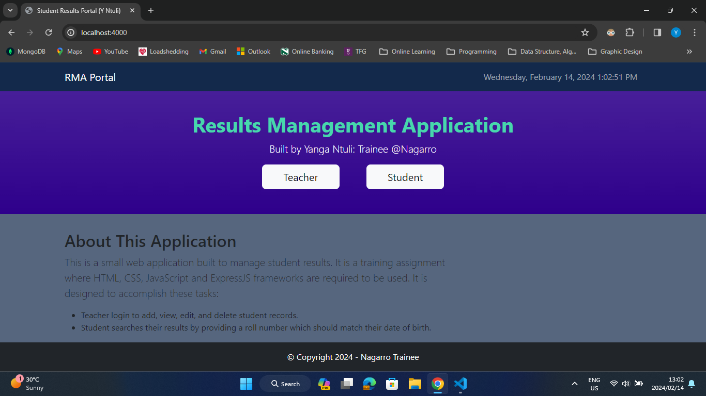

# Results Management Application
## Nagarro Training - NodeJS Assignment

### Description

This is a small web application built to manage student results. It is a training assignment where HTML, CSS, JavaScript, and NodeJS(ExpressJS) frameworks are required to be used. It is designed to accomplish these tasks:

* Teacher login to add, view, edit, and delete student records.
* Student searches their results by providing a roll number which should match their date of birth.
* That's it, just basic CRUD using NodeJS

# How it works!

### Installation Guid
1. npm install

### Run Application
1. npm start
*  or
2. npx nodemon server 

* __NB: Teacher Login Password:__ P@55w0rd 

### Initialization Guid
1. npm i express morgan ejs express-ejs-layouts body-parser dotenv mongoose axios
2. npm install nodemon --save-dev

# Screenshots 

## Landing Page 

## Teacher Login 

## Teacher Options

## List All Student Results

## Add Student Results

## Update Student Results

## Student Login 

## Single Student Results

